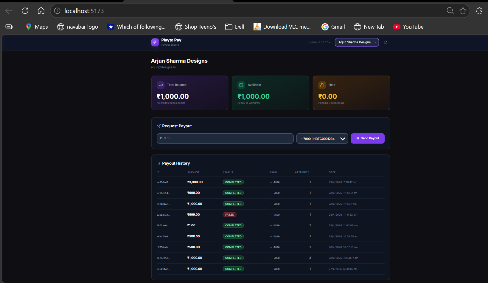
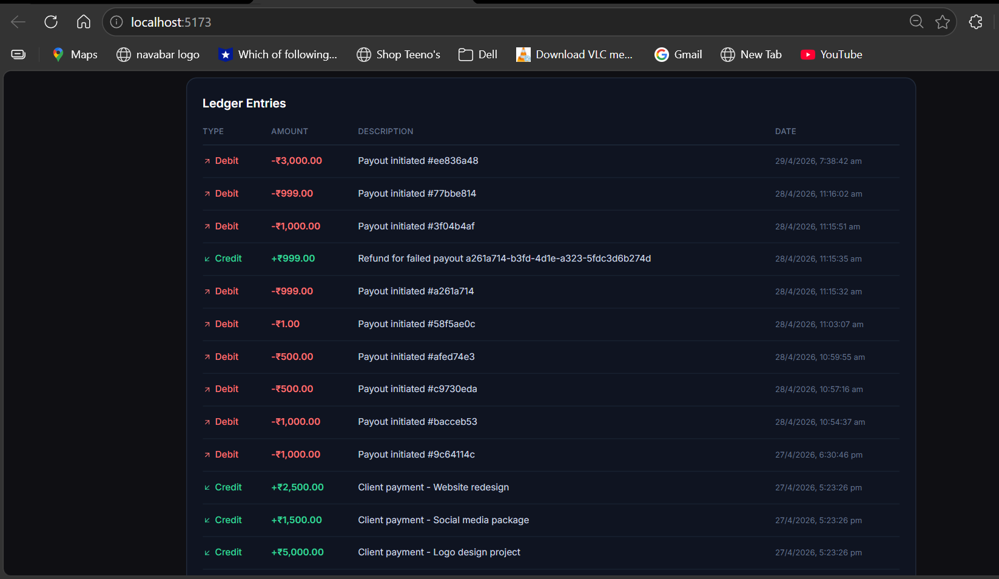
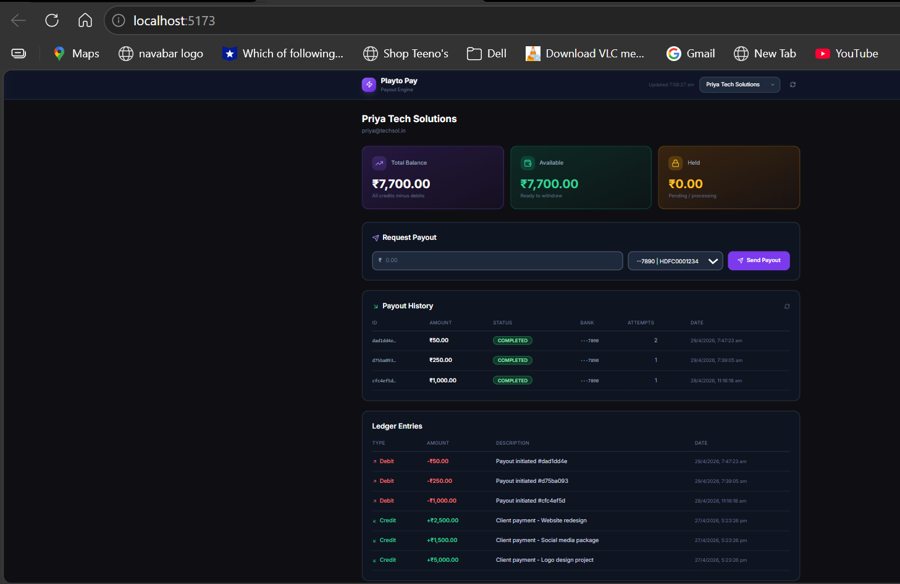
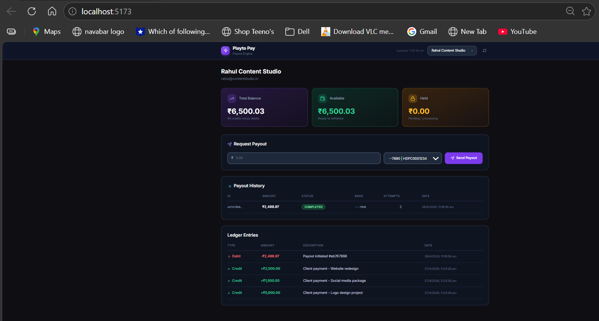

# ⚡ Playto Payout Engine

- Cross-border payout infrastructure for Indian agencies, freelancers, and online businesses.
- Built for the **Playto Founding Engineer Challenge 2026**.

---

## 🌐 Live Demo

| Service               | URL                                                                        |
| --------------------- | -------------------------------------------------------------------------- |
| 🎨 Frontend Dashboard | https://playto-payout-weld.vercel.app                                      |
| 🔌 Backend API        | https://playto-payout-1yb3.onrender.com                                    |
| 📡 Merchants API      | https://playto-payout-1yb3.onrender.com/api/v1/merchants/                  |
| 💰 Balance API        | https://playto-payout-1yb3.onrender.com/api/v1/merchants/1/balance/        |
| 📒 Ledger API         | https://playto-payout-1yb3.onrender.com/api/v1/merchants/1/ledger/         |
| 💸 Payouts API        | https://playto-payout-1yb3.onrender.com/api/v1/payouts/list/?merchant_id=1 |

---

## 📸 Local-Machine Screenshots

### 🎨 Merchant Dashboard — Balance Cards & Ledger


### 💸 Payout Request — Live Status Updates


### ✅ Payout Completed — Funds Settled


### ❌ Payout Failed — Funds Returned to Ledger Automatically


---

## 🏗️ Architecture Overview

```
┌─────────────────┐     ┌──────────────────┐     ┌─────────────┐
│   React + Vite  │────▶│  Django + DRF    │────▶│  PostgreSQL │
│   Tailwind CSS  │     │  Gunicorn WSGI   │     │   (Neon)    │
│   Vercel CDN    │     │  Render Free     │     └─────────────┘
└─────────────────┘     └──────────────────┘            │
                               │                  ┌──────▼──────┐
                        ┌──────▼──────┐           │   Ledger    │
                        │   Celery    │           │   Entries   │
                        │   Worker    │           └─────────────┘
                        └──────┬──────┘
                               │
                        ┌──────▼──────┐
                        │    Redis    │
                        │  (Upstash)  │
                        └─────────────┘
```

---

## 🛠️ Tech Stack

| Layer        | Technology                         | Purpose                                       |
| ------------ | ---------------------------------- | --------------------------------------------- |
| 🎨 Frontend  | React 18 + Vite + Tailwind CSS     | Merchant dashboard with live updates every 4s |
| 🔌 Backend   | Django 4.2 + Django REST Framework | REST API with atomic transactions             |
| 🗄️ Database  | PostgreSQL (Neon)                  | Row-level locking, BigIntegerField for paise  |
| 📬 Queue     | Celery 5.3 + Redis (Upstash)       | Async payout processing with retries          |
| 🔄 Scheduler | Celery Beat                        | Retry stuck payouts every 30 seconds          |
| 🚀 Hosting   | Render + Vercel + Neon + Upstash   | Full production stack, all free tier          |

---

## 📁 Project Structure

```
playto-payout/
├── 📂 backend/
│   ├── 📂 apps/
│   │   ├── 📂 merchants/           # Merchant model + bank accounts
│   │   │   ├── models.py           # Merchant, BankAccount
│   │   │   ├── serializers.py
│   │   │   ├── views.py            # MerchantListView
│   │   │   ├── urls.py
│   │   │   ├── admin.py
│   │   │   └── migrations/
│   │   └── 📂 payouts/             # Core payout engine
│   │       ├── models.py           # Payout, LedgerEntry, IdempotencyKey
│   │       ├── serializers.py
│   │       ├── views.py            # PayoutCreateView with SELECT FOR UPDATE
│   │       ├── tasks.py            # Celery worker — process + retry payouts
│   │       ├── state_machine.py    # Enforces legal state transitions
│   │       ├── urls.py
│   │       ├── admin.py
│   │       └── migrations/
│   ├── 📂 config/
│   │   ├── 📂 settings/
│   │   │   ├── base.py             # Shared settings
│   │   │   ├── development.py      # Local dev settings
│   │   │   └── production.py       # Production settings
│   │   ├── celery.py               # Celery app + beat schedule
│   │   ├── urls.py                 # Root URL config + landing page
│   │   ├── wsgi.py
│   │   └── asgi.py
│   ├── 📂 tests/
│   │   ├── test_concurrency.py     # TransactionTestCase — overdraw prevention
│   │   └── test_idempotency.py     # Idempotency key tests
│   ├── manage.py
│   ├── seed.py                     # Seeds 3 merchants with credit history
│   ├── requirements.txt
│   ├── runtime.txt                 # Pins Python 3.11 for Render
│   ├── build.sh                    # Render build script
│   └── Procfile                    # Gunicorn + Celery start command
├── 📂 frontend/
│   ├── 📂 src/
│   │   ├── 📂 components/
│   │   │   ├── Dashboard.jsx       # Main dashboard with merchant selector
│   │   │   ├── BalanceCard.jsx     # Total, available, held balance cards
│   │   │   ├── PayoutForm.jsx      # Payout request form with validation
│   │   │   ├── PayoutTable.jsx     # Payout history with live status
│   │   │   ├── LedgerTable.jsx     # Credit/debit ledger entries
│   │   │   └── StatusBadge.jsx     # Colored status pill component
│   │   ├── 📂 api/
│   │   │   └── client.js           # Axios API client
│   │   ├── App.jsx
│   │   ├── main.jsx
│   │   └── index.css               # Tailwind imports
│   ├── index.html
│   ├── vite.config.js
│   ├── tailwind.config.js
│   ├── postcss.config.js
│   ├── Dockerfile
│   ├── nginx.conf
│   └── package.json
├── 📄 EXPLAINER.md                 # Architecture decisions + AI audit
├── 📄 README.md
├── 📄 docker-compose.yml           # One-command local setup
└── 📄 render.yaml                  # Render deployment config
```

---

## 🚀 Local Setup

### 📋 Prerequisites

- Python 3.11+
- Node.js 18+
- PostgreSQL (running locally)
- Redis (running locally)

### 1️⃣ Clone the Repository

```bash
git clone https://github.com/SekharSunkara6/Playto-Payout.git
cd Playto-Payout
```

### 2️⃣ Backend Setup

```bash
cd backend

# Create virtual environment
python -m venv venv

# Activate — Windows
venv\Scripts\activate

# Activate — Mac/Linux
source venv/bin/activate

# Install all dependencies
pip install -r requirements.txt
```

### 3️⃣ Environment Variables

Create `backend/.env` (copy from `.env.example`):

```env
SECRET_KEY=your-secret-key-here
DEBUG=True
DB_NAME=playto
DB_USER=postgres
DB_PASSWORD=your-postgres-password
DB_HOST=localhost
DB_PORT=5432
REDIS_URL=redis://localhost:6379/0
ALLOWED_HOSTS=*
DJANGO_SETTINGS_MODULE=config.settings.development
```

### 4️⃣ Database Setup

```bash
# Create database in PostgreSQL
psql -U postgres -c "CREATE DATABASE playto;"

# Run all migrations
python manage.py migrate

# Seed 3 merchants with credit history
python seed.py
```

### 5️⃣ Frontend Setup

```bash
cd frontend

# Install dependencies
npm install
```

Create `frontend/.env`:

```env
VITE_API_URL=http://localhost:8000/api/v1
```

---

## ▶️ Running Locally

Open **4 terminal windows** simultaneously:

**🖥️ Terminal 1 — Django Server**

```bash
cd backend
venv\Scripts\activate
python manage.py runserver
# Runs on http://localhost:8000
```

**⚙️ Terminal 2 — Celery Worker**

```bash
cd backend
venv\Scripts\activate
celery -A config worker -l info --pool=solo
# Processes payouts asynchronously
```

**🔄 Terminal 3 — Celery Beat Scheduler**

```bash
cd backend
venv\Scripts\activate
celery -A config beat -l info
# Retries stuck payouts every 30 seconds
```

**🎨 Terminal 4 — React Frontend**

```bash
cd frontend
npm run dev
# Runs on http://localhost:5173
```

Open **http://localhost:5173** in your browser 🎉

---

## 🐳 Docker Setup (One Command)

```bash
# Start all services — DB, Redis, Backend, Celery, Frontend
docker-compose up
```

| Service        | Port |
| -------------- | ---- |
| PostgreSQL     | 5432 |
| Redis          | 6379 |
| Django Backend | 8000 |
| React Frontend | 5173 |

---

## 🧪 Running Tests

```bash
cd backend
python manage.py test tests -v 2
```

### 📊 Test Coverage

| Test                                           | File                  | Type                  | What it proves                                                                                         |
| ---------------------------------------------- | --------------------- | --------------------- | ------------------------------------------------------------------------------------------------------ |
| `test_concurrent_overdraw_prevented`           | `test_concurrency.py` | `TransactionTestCase` | Two simultaneous ₹60 requests against ₹100 balance — exactly one succeeds, ledger integrity maintained |
| `test_same_key_returns_same_response`          | `test_idempotency.py` | `TestCase`            | Same idempotency key returns identical response, only one payout created in DB                         |
| `test_different_keys_create_different_payouts` | `test_idempotency.py` | `TestCase`            | Different keys create separate payouts correctly                                                       |

> ⚠️ **Why `TransactionTestCase` for concurrency?**
> `select_for_update()` requires real committed transactions to work across
> threads. Django's `TestCase` wraps tests in a transaction that never
> commits — making the lock ineffective. `TransactionTestCase` flushes
> the DB after each test instead, allowing real commits.

**Expected output:**

```
Thread results: [201, 400]
Ledger: credits=10000 debits=6000 remaining=4000
Ran 3 tests in 11.5s
OK
```

---

## 📡 API Reference

### 🔗 Base URL

```
https://playto-payout-1yb3.onrender.com/api/v1
```

### 🏪 Merchant Endpoints

```http
GET /merchants/
```

Returns all merchants with their bank accounts.

**Response:**

```json
[
  {
    "id": 1,
    "name": "Arjun Sharma Designs",
    "email": "arjun@designs.in",
    "bank_accounts": [
      {
        "id": 1,
        "account_number": "501001234567890",
        "ifsc_code": "HDFC0001234",
        "account_holder_name": "Arjun Sharma Designs",
        "is_primary": true
      }
    ]
  }
]
```

```http
GET /merchants/{id}/balance/
```

Returns total, available and held balance in paise.

**Response:**

```json
{
  "merchant_id": 1,
  "merchant_name": "Arjun Sharma Designs",
  "total_balance_paise": 900000,
  "held_balance_paise": 0,
  "available_balance_paise": 900000
}
```

```http
GET /merchants/{id}/ledger/
```

Returns full credit/debit ledger history (last 100 entries).

### 💸 Payout Endpoints

```http
POST /payouts/
Content-Type: application/json
Idempotency-Key: <unique-uuid>

{
  "merchant_id": 1,
  "amount_paise": 50000,
  "bank_account_id": 1
}
```

**Headers required:**
| Header | Description |
|--------|-------------|
| `Idempotency-Key` | Merchant-supplied UUID. Same key = same response. Expires after 24h. |

**Response (201 Created):**

```json
{
  "id": "uuid-here",
  "merchant": 1,
  "amount_paise": 50000,
  "amount_inr": 500.0,
  "status": "PENDING",
  "bank_account_last4": "7890",
  "attempt_count": 0,
  "failure_reason": "",
  "created_at": "2026-04-28T10:00:00Z",
  "updated_at": "2026-04-28T10:00:00Z"
}
```

**Error Responses:**
| Status | Reason |
|--------|--------|
| 400 | Insufficient balance |
| 400 | Missing required fields |
| 404 | Merchant or bank account not found |

```http
GET /payouts/list/?merchant_id={id}
```

Returns payout history with live status (last 50).

### 🔄 Payout Lifecycle

```
PENDING ──▶ PROCESSING ──▶ COMPLETED ✅
                  │
                  └──▶ FAILED ❌ (funds returned atomically to ledger)
```

| Outcome           | Probability |
| ----------------- | ----------- |
| ✅ Success        | 70%         |
| ❌ Failure        | 20%         |
| ⏳ Hang (retried) | 10%         |

---

## 🔐 Key Engineering Decisions

### 💰 1. Money as Paise — BigIntegerField Only

```python
# models.py
amount_paise = models.BigIntegerField()  # NEVER FloatField or DecimalField
```

All amounts stored as integers in paise (1 INR = 100 paise).
Eliminates floating point precision errors in financial calculations entirely.

---

### 📊 2. Database-level Balance Calculation

```python
# merchants/models.py — get_balance()
LedgerEntry.objects.filter(merchant=self).aggregate(
    total=Sum(
        Case(
            When(entry_type='CREDIT', then='amount_paise'),
            When(entry_type='DEBIT', then=F('amount_paise') * -1),
            output_field=BigIntegerField(),
        )
    )
)
```

Balance derived from a single DB aggregation query — never Python arithmetic
on fetched rows. One SQL query, no stale reads, works correctly under
concurrent writes.

---

### 🔒 3. SELECT FOR UPDATE — Concurrency Lock

```python
# payouts/views.py — PayoutCreateView
with transaction.atomic():
    # Lock merchant row at PostgreSQL level
    merchant_locked = Merchant.objects.select_for_update().get(pk=merchant.pk)

    # Compute balance INSIDE the lock
    available = total_credits - total_debits - held

    if available < amount_paise:
        return Response({'error': 'Insufficient balance'}, status=400)

    # Create payout while holding the lock
    Payout.objects.create(...)
    LedgerEntry.objects.create(entry_type='DEBIT', ...)
```

`SELECT FOR UPDATE` acquires a PostgreSQL row-level exclusive lock.
Concurrent requests queue at the DB level — not Python level.
Eliminates the TOCTOU race condition entirely.

---

### 🔑 4. Idempotency Keys

```python
# Scoped per merchant, 24h TTL, unique_together constraint
IdempotencyKey.objects.get_or_create(
    merchant=merchant,
    key=idempotency_key,
    defaults={
        'response_body': response_data,
        'response_status': 201,
        'expires_at': now + timedelta(hours=24),
    }
)
```

- Keys scoped per `(merchant, key)` with `unique_together` constraint
- 24-hour TTL — expired keys allow re-use
- Same key = same response, no duplicate payout created
- Safe to retry on network failure

---

### ⚙️ 5. State Machine

```python
# payouts/state_machine.py
VALID_TRANSITIONS = {
    'PENDING':    ['PROCESSING'],
    'PROCESSING': ['COMPLETED', 'FAILED'],
    'COMPLETED':  [],   # Terminal — no transitions allowed
    'FAILED':     [],   # Terminal — no transitions allowed
}
```

- All status changes go through single `transition_payout()` function
- Illegal transitions raise `InvalidTransitionError`
- `COMPLETED → PENDING` = blocked
- `FAILED → COMPLETED` = blocked
- Failed payout fund refund is **atomic** with state transition

---

### 🔄 6. Retry Logic with Exponential Backoff

```python
# payouts/tasks.py — retry_stuck_payouts (runs every 30s via Celery Beat)
if payout.attempt_count >= MAX_ATTEMPTS:  # MAX = 3
    transition_payout(payout, 'FAILED', 'Max retry attempts exceeded')
else:
    backoff = 2 ** payout.attempt_count   # 2s, 4s, 8s
    process_payout.apply_async(args=[str(payout.id)], countdown=backoff)
```

- Payouts stuck in PROCESSING for 30+ seconds are auto-retried
- Exponential backoff: 2^attempt seconds between retries
- Max 3 attempts then FAILED + funds returned atomically

---

## 🌱 Seed Data

3 merchants pre-loaded with simulated client payment history:

| Merchant             | Email                  | Balance | Bank         |
| -------------------- | ---------------------- | ------- | ------------ |
| Arjun Sharma Designs | arjun@designs.in       | ₹9,000  | HDFC ···7890 |
| Priya Tech Solutions | priya@techsol.in       | ₹9,000  | HDFC ···7890 |
| Rahul Content Studio | rahul@contentstudio.in | ₹9,000  | HDFC ···7890 |

Each merchant has 3 seed credits:

- ₹5,000 — Logo design project
- ₹1,500 — Social media package
- ₹2,500 — Website redesign

---

## 🚀 Deployment

### Production Stack

| Service                  | Platform | Plan |
| ------------------------ | -------- | ---- |
| 🔌 Backend (Django)      | Render   | Free |
| 🎨 Frontend (React)      | Vercel   | Free |
| 🗄️ Database (PostgreSQL) | Neon     | Free |
| 📬 Queue (Redis)         | Upstash  | Free |

### Environment Variables (Production)

| Key                      | Description                       |
| ------------------------ | --------------------------------- |
| `DJANGO_SETTINGS_MODULE` | `config.settings.production`      |
| `SECRET_KEY`             | Django secret key                 |
| `DEBUG`                  | `False`                           |
| `DATABASE_URL`           | Neon PostgreSQL connection string |
| `REDIS_URL`              | Upstash Redis connection string   |
| `ALLOWED_HOSTS`          | `*`                               |

> ⚠️ **Note on Celery in Production:**
> Render free tier does not support background workers without payment.
> Payouts remain in PENDING state on the live demo.
> The full payout lifecycle works correctly in local development
> with all 4 terminals running simultaneously.

---

## 📝 Submission Details

| Item            | Value                                            |
| --------------- | ------------------------------------------------ |
| 🔗 GitHub       | https://github.com/SekharSunkara6/Playto-Payout  |
| 🌐 Live Demo    | https://playto-payout-weld.vercel.app            |
| 🔌 Backend API  | https://playto-payout-1yb3.onrender.com          |
| 📄 EXPLAINER.md | See EXPLAINER.md in repo root                    |
| 🧪 Tests        | `python manage.py test tests -v 2` → 3 tests, OK |
| 🏆 Challenge    | Playto Founding Engineer Challenge 2026          |

---

## 👨‍💻 What I'm Most Proud Of

The **concurrency handling** — using PostgreSQL's `SELECT FOR UPDATE`
on the Merchant row to serialize concurrent payout requests at the
database level, not Python level. Two simultaneous ₹60 requests against
₹100 balance: exactly one succeeds, one gets 400, ledger integrity
maintained. Proven by a `TransactionTestCase` that uses real committed
transactions across threads.

The **ledger model** (immutable double-entry rows, never a mutable
balance column) means the balance is always derivable from first
principles — no drift possible, full audit trail built-in.

The **atomic state machine** that refunds funds on failure in the same
`transaction.atomic()` block as the status change either both happen
or neither does.
